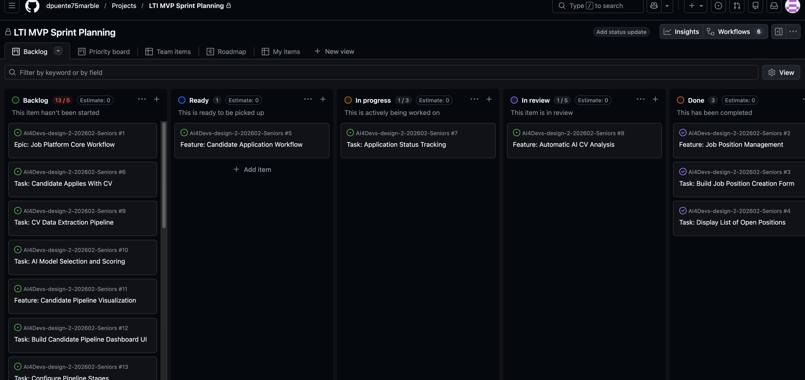

# LTI - User Stories iniciales

# Job Platform Core Workflow

Proyecto de diseño y gestión de un sistema de reclutamiento basado en GitHub Issues y Kanban.

El objetivo ha sido definir, estructurar y simular el ciclo completo de desarrollo de una aplicación real, desde la definición del backlog hasta la ejecución de tareas, aplicando buenas prácticas de gestión ágil y flujo de trabajo profesional.

---

## 🎯 Objetivo

Diseñar un sistema que permita:

- Crear y gestionar posiciones de trabajo
- Permitir a candidatos aplicar con CV
- Analizar CVs automáticamente con IA
- Visualizar el pipeline de selección
- Gestionar feedback estructurado
- Planificar entrevistas

---

## 🧠 Enfoque

Se ha aplicado una estructura basada en:

- **Epic** → visión global del sistema
- **Features** → agrupación funcional
- **Tasks** → unidades de trabajo ejecutables

Toda la gestión se ha realizado mediante **GitHub Issues + GitHub Projects (Kanban)**.

---

## 📂 Repositorio y gestión

🔗 Repositorio del proyecto:
https://github.com/dpuente75marble

🔗 Tablero Kanban (GitHub Projects):
https://github.com/users/dpuente75marble/projects/1

---

## 🧩 Estructura del backlog

### Epic

- Job Platform Core Workflow

### Features

- Job Position Management
- Candidate Application Workflow
- Automatic AI CV Analysis
- Candidate Pipeline Visualization
- Structured Feedback
- Interview Scheduling System

### Tasks

Cada feature ha sido descompuesta en tareas concretas con:

- criterios de aceptación
- notas técnicas
- endpoints sugeridos

---

## 🔄 Flujo de trabajo (Kanban)

Se ha simulado un flujo real de desarrollo:

## 📊 Tablero Kanban

**Backlog → Ready → In Progress → In Review → Done**

- Priorización de funcionalidades
- Ejecución iterativa por tareas
- Validación antes del cierre
- Cierre de features solo cuando todas sus tasks están completadas

---

## ⚙️ Flujo técnico (Git + PR)

Para cada tarea se ha seguido un proceso profesional:

1. Creación de Issue en GitHub
2. Asociación al Kanban
3. Creación de rama `feature/...`
4. Desarrollo de la funcionalidad
5. Commit con mensaje descriptivo
6. Push a repositorio remoto
7. Creación de Pull Request
8. Revisión de cambios
9. Merge a rama principal
10. Movimiento de la tarea a **Done**

---

## 🤖 Uso de IA

Se ha utilizado IA (Copilot / ChatGPT) como soporte en:

- Generación inicial del backlog
- Definición de tareas y criterios
- Apoyo en decisiones técnicas
- Simulación del flujo de desarrollo

La IA ha sido utilizada como **asistente**, manteniendo siempre el criterio técnico en la toma de decisiones.

---

## 🚀 Mejoras futuras

- Añadir estimaciones (Story Points)
- Definir Definition of Done (DoD)
- Incorporar Definition of Ready (DoR)
- Implementar testing strategy
- Integrar CI/CD
- Desarrollar la aplicación completa (frontend + backend)

---

## 📌 Conclusión

Este proyecto demuestra no solo la capacidad de estructurar un sistema desde el punto de vista funcional, sino también de organizar el trabajo siguiendo un flujo profesional, alineado con metodologías ágiles y prácticas reales de desarrollo en equipo.

Se ha puesto especial foco en la claridad del backlog, la trazabilidad de tareas y la simulación de un entorno real de trabajo.
