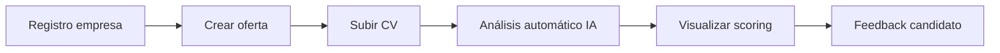
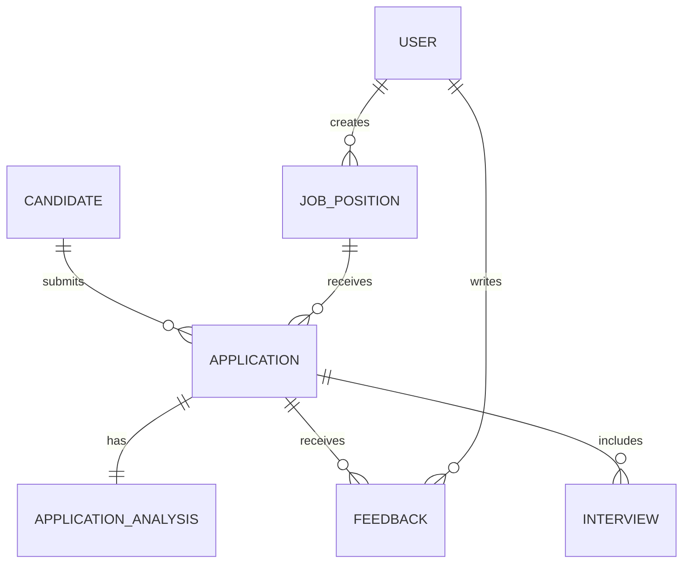

# User Stories iniciales - LTI

## Contexto

Este documento forma parte de la evolución del PRD generado en el módulo anterior.

El producto definido es LTI, una plataforma ATS (Applicant Tracking System) AI-native orientada a optimizar procesos de selección mediante automatización, scoring de candidatos y colaboración entre recruiters y hiring managers.

Para la definición de las User Stories y el backlog se han tomado como base:

* Funcionalidades clave definidas en el PRD
* Casos de uso principales
* Modelo de datos inicial
* Arquitectura de alto nivel

Repositorio del PRD base:
https://github.com/dpuente75marble/AI4Devs-design-1-202602-Seniors/blob/feature/lti-ddlp/lti/ddlp/LTI-iniciales.md

---

## Scope de esta iteración (MVP)

Este backlog se centra en una primera iteración del producto (MVP), priorizando:

* Creación y gestión de vacantes
* Recepción y visualización de candidaturas
* Evaluación inicial con soporte de IA
* Colaboración básica entre recruiters

Quedan fuera de alcance en esta fase:

* Integraciones con job boards externos
* Automatización avanzada de decisiones
* Analítica avanzada

---

## User Story Mapping

---

## User Stories

### US-01 - Crear una vacante

**Historia de usuario**
Como recruiter,
quiero crear una vacante con la información principal del puesto,
para iniciar un nuevo proceso de selección de forma estructurada.

**Criterios de aceptación**

* Creación correcta en estado draft
* Validación de campos obligatorios
* Edición antes de publicación

**Notas adicionales**

* Campos mínimos: título, departamento, ubicación, tipo de contrato, descripción, requisitos
* Estado inicial: draft

**Consideraciones técnicas**

* Endpoint: `POST /job-positions`
* Modelo: `JobPosition`
* Validación en frontend y backend
* Persistencia en base de datos relacional

---

### US-02 - Recepción de candidaturas

**Historia de usuario**
Como candidato,
quiero aplicar a una vacante enviando mi CV,
para participar en el proceso.

**Criterios de aceptación**

* Aplicación exitosa
* Validación de campos
* Confirmación al usuario

**Notas adicionales**

* Campos: nombre, email, CV

**Consideraciones técnicas**

* Endpoint: `POST /applications`
* Upload de archivos (CV)
* Almacenamiento en storage (S3 o similar)
* Modelos: `Candidate`, `Application`, `JobPosition`

---

### US-03 - Análisis automático de CV con IA

**Historia de usuario**
Como recruiter,
quiero que el sistema analice CVs automáticamente,
para obtener scoring e información estructurada.

**Criterios de aceptación**

* Extracción de datos
* Generación de score
* Persistencia
* Gestión de errores

**Notas adicionales**

* Uso de IA (LLM)
* JSON estructurado

**Consideraciones técnicas**

* Servicio de procesamiento asíncrono
* Integración con API de IA
* Modelo: `ApplicationAnalysis`
* Cola de procesamiento (queue)
* Manejo de errores y reintentos

---

### US-04 - Visualización de candidatos en pipeline

**Historia de usuario**
Como recruiter,
quiero ver candidatos en pipeline,
para gestionar el proceso.

**Criterios de aceptación**

* Visualización tipo kanban
* Cambio de estado drag & drop
* Persistencia
* Información básica visible

**Notas adicionales**

* Estados configurables

**Consideraciones técnicas**

* Endpoint: `GET /applications`
* Endpoint: `PATCH /applications/{id}`
* Estado almacenado en BD
* Frontend con drag & drop
* Sincronización en tiempo real (opcional)

---

### US-05 - Registro de feedback estructurado

**Historia de usuario**
Como hiring manager,
quiero registrar feedback,
para colaborar en decisiones.

**Criterios de aceptación**

* Registro de feedback
* Visualización
* Control de permisos

**Notas adicionales**

* RBAC básico

**Consideraciones técnicas**

* Endpoint: `POST /feedback`
* Endpoint: `GET /feedback`
* Modelo: `Feedback`
* Sistema de roles y permisos
* Relación con `Application` y `User`

---

### US-06 - Planificación de entrevistas

**Historia de usuario**
Como recruiter,
quiero planificar entrevistas,
para avanzar en el proceso.

**Criterios de aceptación**

* Creación
* Notificación
* Visualización
* Reprogramación

**Notas adicionales**

* Integración futura con calendarios

**Consideraciones técnicas**

* Endpoint: `POST /interviews`
* Endpoint: `PATCH /interviews/{id}`
* Modelo: `Interview`
* Sistema de notificaciones (email)
* Integración futura con Google/Outlook

---

## Priorización del backlog (MVP)

1. US-01
2. US-02
3. US-03
4. US-04
5. US-05
6. US-06

---

## Definition of Ready (DoR)

* Historia clara
* Criterios definidos
* Datos conocidos
* Sin bloqueos
* Estimada

---

## Definition of Done (DoD)

* Desarrollo completado
* Código revisado
* Tests básicos
* Sin errores críticos
* Deploy listo

---

## Modelo de Datos (Data Model)

A continuación se define un modelo de datos simplificado para el MVP de LTI.

### Entidades principales

#### JobPosition

* id
* title
* department
* location
* contractType
* description
* requirements
* status (`draft`, `published`)
* createdAt

#### Candidate

* id
* name
* email
* createdAt

#### Application

* id
* candidateId
* jobPositionId
* cvUrl
* status (`applied`, `review`, `interview`, `offer`, `rejected`)
* score
* createdAt

#### ApplicationAnalysis

* id
* applicationId
* extractedData (JSON)
* score
* processedAt
* status (`pending`, `processed`, `error`)

#### Feedback

* id
* applicationId
* userId
* rating
* comments
* strengths
* risks
* createdAt

#### Interview

* id
* applicationId
* date
* status (`scheduled`, `completed`, `cancelled`)
* notes

#### User

* id
* name
* email
* role (`recruiter`, `hiring_manager`, `admin`)

---

### Relaciones principales

* Un `User` puede crear múltiples `JobPosition`
* Un `Candidate` puede enviar múltiples `Application`
* Una `JobPosition` puede recibir múltiples `Application`
* Una `Application` puede tener un `ApplicationAnalysis`
* Una `Application` puede tener múltiples `Feedback`
* Una `Application` puede tener múltiples `Interview`

---

### Diagrama entidad-relación

---

## Arquitectura de alto nivel

El sistema LTI se basa en una arquitectura desacoplada con separación entre frontend, backend y servicios externos.

### Componentes principales

* **Frontend (React)**

  * Gestión de UI (vacantes, pipeline, feedback)
  * Comunicación con backend vía API REST

* **Backend (Node.js / Express)**

  * Gestión de lógica de negocio
  * Exposición de endpoints REST
  * Gestión de autenticación y permisos

* **Base de datos**

  * Persistencia de entidades principales

* **Servicio de IA**

  * Procesamiento de CVs
  * Generación de scoring

* **Sistema de almacenamiento**

  * Almacenamiento de CVs (ej: S3)

* **Sistema de notificaciones**

  * Emails para candidatos

---

### Flujo simplificado

1. Recruiter crea vacante
2. Candidate aplica → se almacena CV
3. Sistema procesa CV con IA
4. Recruiter gestiona pipeline
5. Hiring manager añade feedback
6. Se planifican entrevistas

---

### Consideraciones

* Arquitectura preparada para escalar
* Procesos de IA desacoplados (async)
* Separación clara de responsabilidades
